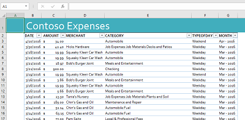

# <a name="excel-add-in-with-aspnet-and-quickbooks"></a>Excel-Add-In mit ASP.NET und QuickBooks

Excel-Add-Ins können eine Verbindung mit einem Dienst wie QuickBooks herstellen und Daten in eine Excel-Tabelle importieren. Dieses Excel-Add-In veranschaulicht das Herstellen einer Verbindung mit QuickBooks, ruft Beispielausgabedaten aus einem von QuickBooks bereitgestellten Sandkastenkonto **Sandbox Company_US_1**, und importiert die Beispieldaten in eine Tabelle. Das Add-In stellt auch eine Schaltfläche zum Erstellen eines Diagramms aus den Beispieldaten bereit.

## <a name="table-of-contents"></a>Inhalt

* [Voraussetzungen](#prerequisites)
* [Konfigurieren des Projekts](#configure-the-project)
* [Ausführen des Projekts](#run-the-project)
* [Grundlegendes zum Code](#understand-the-code)
* [Verbinden mit Office 365](#connect-to-office-365)
* [Fragen und Kommentare](#questions-and-comments)
* [Zusätzliche Ressourcen](#additional-resources)

## <a name="prerequisites"></a>Voraussetzungen

* Ein [QuickBooks-Entwickler](https://developer.intuit.com/)konto
* [Visual Studio 2015](https://www.visualstudio.com/downloads/download-visual-studio-vs.aspx)
* [Office Developer Tools für Visual Studio](https://www.visualstudio.com/en-us/features/office-tools-vs.aspx)

## <a name="configure-the-project"></a>Konfigurieren des Projekts

Konfigurieren Sie zunächst Ihre App unter developer.intuit.com.

1. Rufen Sie https://developer.intuit.com/ auf, registrieren Sie sich für ein Entwicklerkonto, und melden Sie sich dann mit diesem an.
2. Wählen Sie in der oberen rechten Ecke **Meine Apps**, und wählen Sie eine App aus, oder klicken Sie auf **Neue App erstellen**. 
3. Wählen Sie, nachdem die App ausgewählt ist, **Entwicklung** | **Schlüssel**, und kopieren Sie den **OAuth-Consumerschlüssel** und den **Geheimen OAuth-Consumerschlüssel** an einen Ort, auf den Sie später zugreifen können.
4. Laden Sie das Beispiel auf Ihrem lokalen Computer herunter, oder klonen Sie dieses.
5. Öffnen Sie die Projektmappe **QbAdd-inDotNet.sln** in Visual Studio.
6. Öffnen Sie in Visual Studio **Web.config**, und fügen Sie die Werte für `ConsumerKey` und `ConsumerSecret` wie folgt ein.

```
<appSettings>
    <!-- QuickBooks Settings -->
    <add key="ConsumerKey" value="insert your OAuth Consumer Key here" />
    <add key="ConsumerSecret" value="insert your OAuth Consumer Secret here" />
    <add key="OauthLink" value="https://oauth.intuit.com/oauth/v1" />
    <add key="AuthorizeUrl" value="https://workplace.intuit.com/Connect/Begin" />
    <add key="RequestTokenUrl" value="https://oauth.intuit.com/oauth/v1/get_request_token" />
    <add key="AccessTokenUrl" value="https://oauth.intuit.com/oauth/v1/get_access_token" />
    <add key="ServiceContext.BaseUrl.Qbo" value="https://sandbox-quickbooks.api.intuit.com/" />
    <add key="DeepLink" value="sandbox.qbo.intuit.com" />
  </appSettings>
```

## <a name="run-the-project"></a>Ausführen des Projekts

1. Drücken Sie F5, um das Projekt auszuführen.

2. Starten Sie das Add-in, indem Sie im Menüband in Excel die Befehlsschaltfläche auswählen.<br>  

3. Klicken Sie auf **Mit QuickBooks** verbinden, um das Anmeldefenster für QuickBooks zu öffnen.<br>

4. Wenn ein Fehlerfenster in Visual Studio geöffnet wird, klicken Sie auf **Weiter**, und navigieren Sie wieder zu Excel. Dieser Fehler tritt nicht im Zusammenhang mit dem Beispiel auf.<br>

5. Melden Sie sich mit Ihrem QuickBooks-Entwicklerkonto bei QuickBooks an.<br>

6. Klicken Sie auf **Autorisieren**, um QuickBooks das Senden von Daten an das Add-In zu ermöglichen.<br> <br> Im Aufgabenbereich werden zwei Aktionen zur Auswahl angezeigt. <br>

8. Wählen Sie **Ausgaben abrufen** aus, um Ausgaben vonQuickBooks in eine Tabelle zu importieren. <br>

9. Wählen Sie **Diagramm erstellen** aus, um ein Diagramm einzufügen. <br>

## <a name="understand-the-code"></a>Grundlegendes zum Code

* [Home.HTML](QbAdd-inDotNetWeb/Home.html) Definiert die Aufgabenbereichsseite, die beim Start und nach Anmeldung des Benutzers angezeigt wird.
* [Home.js](QbAdd-inDotNetWeb/Home.js) Verarbeitet die Benutzerinteraktion für Registrierung, Anmeldung, Abrufen von Ausgaben und Einfügen von Diagrammen. Hier wird die `dialogDisplayAsync`-API aufgerufen, um ein Dialogfeld für den Benutzer zur Anmeldung bei QuickBooks zu öffnen.
* [QbAdd-inDotNet.xml](QbAdd-inDotNet/QbAdd-inDotNetManifest/QbAdd-inDotNet.xml) Die Manifestdatei für das Add-In. 
* [QuickBooksController.cs](QbAdd-inDotNetWeb/Controllers/QuickBooksController.cs) Ruft Ausgabedaten aus QuickBooks ab.
* [FunctionFile.js](QbAdd-inDotNetWeb/Functions/FunctionFile.js) Fügt ein Diagramm in Excel hinzu.
* [OAuthManager.aspx.cs](QbAdd-inDotNetWeb/OAuthManager.aspx.cs) Verarbeitet die Anmeldung bei QuickBooks über die Dialogfeld-API.

## <a name="questions-and-comments"></a>Fragen und Kommentare

Wir freuen uns auf Ihr Feedback zu dem Beispiel *Excel-Add-In mit ASPNET und QuickBooks* Sie können uns Ihr Feedback über den Abschnitt *Probleme* dieses Repositorys senden. Allgemeine Fragen zur Office 365-Entwicklung sollten in [Stack Overflow](http://stackoverflow.com/questions/tagged/Office365+API) gestellt werden. Stellen Sie sicher, dass Ihre Fragen mit [Office365] und [API] markiert sind.

## <a name="additional-resources"></a>Zusätzliche Ressourcen

* [Dokumentation zu Office 365-APIs](http://msdn.microsoft.com/office/office365/howto/platform-development-overview)
* [Microsoft Office 365 API-Tools](https://visualstudiogallery.msdn.microsoft.com/a15b85e6-69a7-4fdf-adda-a38066bb5155)
* [Office Dev Center](http://dev.office.com/)
* [Office 365 APIs – Startprojekte und Codebeispiele](http://msdn.microsoft.com/en-us/office/office365/howto/starter-projects-and-code-samples)

## <a name="copyright"></a>Copyright
Copyright (c) 2016 Microsoft. Alle Rechte vorbehalten.


In diesem Projekt wurden die [Microsoft Open Source-Verhaltensregeln](https://opensource.microsoft.com/codeofconduct/) übernommen. Weitere Informationen finden Sie unter [Häufig gestellte Fragen zu Verhaltensregeln](https://opensource.microsoft.com/codeofconduct/faq/), oder richten Sie Ihre Fragen oder Kommentare an [opencode@microsoft.com](mailto:opencode@microsoft.com).
