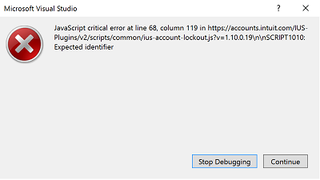
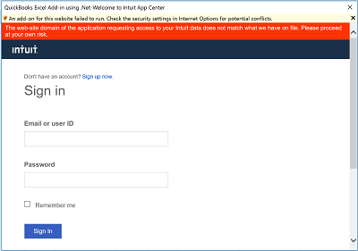
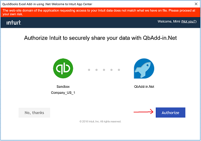

# <a name="excel-add-in-with-aspnet-and-quickbooks"></a>Complemento de Excel con ASP.NET y QuickBooks

El complemento de Excel puede conectarse a un servicio como QuickBooks e importar datos en la hoja de cálculo de Excel. Este complemento de Excel muestra cómo conectarse a QuickBooks, obtiene datos de gastos de ejemplo de una cuenta de espacio aislado proporcionada por QuickBooks, **Sandbox Company_US_1**, e importa los datos de ejemplo en una hoja de cálculo. El complemento proporciona también un botón para crear un gráfico a partir de los datos de ejemplo.

## <a name="table-of-contents"></a>Tabla de contenido

* [Requisitos previos](#prerequisites)
* [Configurar el proyecto](#configure-the-project)
* [Ejecutar el proyecto](#run-the-project)
* [Entender el código](#understand-the-code)
* [Conectarse a Office 365](#connect-to-office-365)
* [Preguntas y comentarios](#questions-and-comments)
* [Recursos adicionales](#additional-resources)

## <a name="prerequisites"></a>Requisitos previos

* Una cuenta de [desarrollador de QuickBooks](https://developer.intuit.com/)
* [Visual Studio 2015](https://www.visualstudio.com/downloads/download-visual-studio-vs.aspx)
* [Office Developer Tools para Visual Studio](https://www.visualstudio.com/en-us/features/office-tools-vs.aspx)

## <a name="configure-the-project"></a>Configurar el proyecto

Configure la aplicación en developer.intuit.com para comenzar.

1. Vaya a https://developer.intuit.com/ y regístrese para obtener una cuenta de desarrollador y, después, inicie sesión.
2. En la esquina superior derecha, elija **Mis aplicaciones** y seleccione una aplicación o haga clic en **Crear nueva aplicación**. 
3. Una vez que haya seleccionado la aplicación, elija **Desarrollo** | **Claves** y copie la **clave de consumidor OAuth** y el **secreto de consumidor OAuth** en un lugar desde el que pueda acceder a ellos más tarde.
4. Descargue o copie el ejemplo en el equipo local.
5. Abra el archivo de la solución **QbAdd-inDotNet.sln** en Visual Studio.
6. En Visual Studio, abra **Web.config** e inserte los valores de `ConsumerKey` y `ConsumerSecret`, de esta forma.

```
<appSettings>
    <!-- QuickBooks Settings -->
    <add key="ConsumerKey" value="insert your OAuth Consumer Key here" />
    <add key="ConsumerSecret" value="insert your OAuth Consumer Secret here" />
    <add key="OauthLink" value="https://oauth.intuit.com/oauth/v1" />
    <add key="AuthorizeUrl" value="https://workplace.intuit.com/Connect/Begin" />
    <add key="RequestTokenUrl" value="https://oauth.intuit.com/oauth/v1/get_request_token" />
    <add key="AccessTokenUrl" value="https://oauth.intuit.com/oauth/v1/get_access_token" />
    <add key="ServiceContext.BaseUrl.Qbo" value="https://sandbox-quickbooks.api.intuit.com/" />
    <add key="DeepLink" value="sandbox.qbo.intuit.com" />
  </appSettings>
```

## <a name="run-the-project"></a>Ejecutar el proyecto

1. Pulse F5 para ejecutar el proyecto.

2. Inicie el complemento seleccionando el botón de comando de la cinta de opciones en Excel.<br>  

3. Haga clic en **Conectarse a QuickBooks** para que se abra la ventana de inicio de sesión de QuickBooks.<br>

4. Si se abre una ventana de error en Visual Studio, haga clic en **Continuar** y vuelva a Excel. Este error no está relacionado con el ejemplo.<br>

5. Inicie sesión en QuickBooks con su cuenta de desarrollador de QuickBooks.<br>

6. Haga clic en **Autorizar** para permitir que QuickBooks envíe datos al complemento.<br> <br> El panel de tareas mostrará dos acciones para elegir. <br>

8. Elija **Obtener gastos** para importar los gastos de QuickBooks en una hoja de cálculo. <br>

9. Elija **Crear gráfico** para insertar un gráfico. <br>

## <a name="understand-the-code"></a>Entender el código

* [Home.html](QbAdd-inDotNetWeb/Home.html): define la página del panel de tareas en el inicio y después de que el usuario haya iniciado sesión.
* [Home.js](QbAdd-inDotNetWeb/Home.js): identifica la interacción del usuario para iniciar sesión, cerrar sesión, obtener los gastos e insertar gráficos. En este caso, se llama a la API de `dialogDisplayAsync` para que se abra una ventana de diálogo para que el usuario inicie sesión en QuickBooks.
* [QbAdd-inDotNet.xml](QbAdd-inDotNet/QbAdd-inDotNetManifest/QbAdd-inDotNet.xml): el archivo de manifiesto del complemento. 
* [QuickBooksController.cs](QbAdd-inDotNetWeb/Controllers/QuickBooksController.cs): obtiene datos de gastos de QuickBooks.
* [FunctionFile.js](QbAdd-inDotNetWeb/Functions/FunctionFile.js): agrega un gráfico a Excel.
* [OAuthManager.aspx.cs](QbAdd-inDotNetWeb/OAuthManager.aspx.cs): controla el inicio de sesión en QuickBooks de la API de cuadros de diálogo.

## <a name="questions-and-comments"></a>Preguntas y comentarios

Nos encantaría recibir sus comentarios sobre el ejemplo del *complemento de Excel con ASPNET y QuickBooks*. Puede enviarnos comentarios a través de la sección *Problemas* de este repositorio. Las preguntas generales sobre desarrollo en Office 365 deben publicarse en [Stack Overflow](http://stackoverflow.com/questions/tagged/Office365+API). Asegúrese de que sus preguntas se etiquetan con [Office365] y [API].

## <a name="additional-resources"></a>Recursos adicionales

* [Documentación de las API de Office 365](http://msdn.microsoft.com/office/office365/howto/platform-development-overview)
* [Herramientas de API de Microsoft Office 365](https://visualstudiogallery.msdn.microsoft.com/a15b85e6-69a7-4fdf-adda-a38066bb5155)
* [Centro de desarrollo de Office](http://dev.office.com/)
* [Proyectos de inicio y ejemplos de código de las API de Office 365](http://msdn.microsoft.com/en-us/office/office365/howto/starter-projects-and-code-samples)

## <a name="copyright"></a>Copyright
Copyright (c) 2016 Microsoft. Todos los derechos reservados.


Este proyecto ha adoptado el [Código de conducta de código abierto de Microsoft](https://opensource.microsoft.com/codeofconduct/). Para obtener más información, consulte las [preguntas más frecuentes sobre el Código de conducta](https://opensource.microsoft.com/codeofconduct/faq/) o póngase en contacto con [opencode@microsoft.com](mailto:opencode@microsoft.com) si tiene otras preguntas o comentarios.
