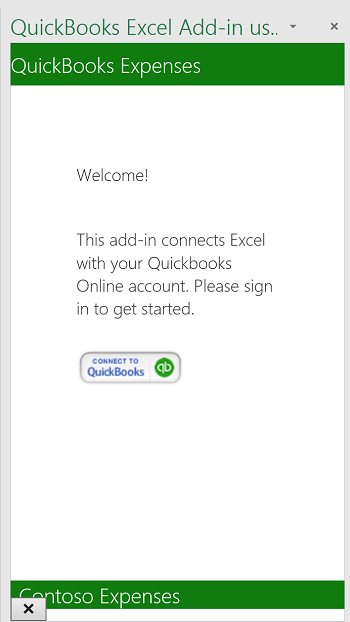
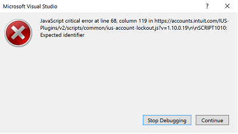
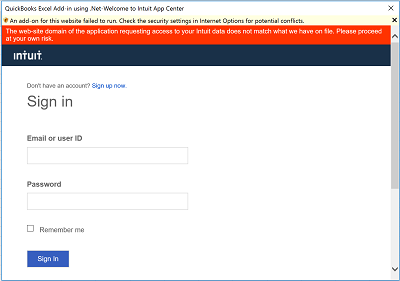
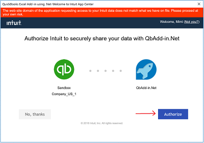
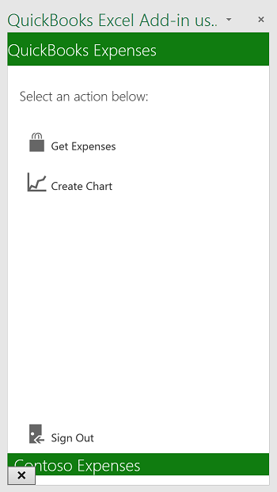
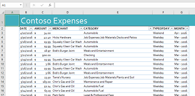
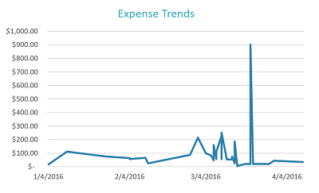

# ASP.NET と QuickBooks を使用する Excel アドイン

Excel アドインで、QuickBooks のようなサービスに接続して、Excel スプレッドシートにデータをインポートできます。この Excel アドインでは、QuickBooks に接続し、QuickBooks が提供するサンドボックス アカウント (**Sandbox Company_US_1**) からサンプルの支出データを取得し、サンプル データをスプレッドシートにインポートする方法を示します。アドインには、サンプル データからグラフを作成するためのボタンも用意されています。

## 目次

* [前提条件](#prerequisites)
* [プロジェクトを構成する](#configure-the-project)
* [プロジェクトを実行する](#run-the-project)
* [コードを理解する](#understand-the-code)
* [Office 365 に接続する](#connect-to-office-365)
* [質問とコメント](#questions-and-comments)
* [その他の技術情報](#additional-resources)

## 前提条件

* [QuickBooks 開発者](https://developer.intuit.com/)アカウント
* [Visual Studio 2015](https://www.visualstudio.com/downloads/download-visual-studio-vs.aspx)
* [Office Developer Tools for Visual Studio](https://www.visualstudio.com/en-us/features/office-tools-vs.aspx)

## プロジェクトを構成する

Developer.intuit.com でアプリを構成することから始めます。

1. Https://developer.intuit.com/ にアクセスし、開発者アカウントを新規登録して、サインインします。
2. 右上隅にある **[マイ アプリ]** を選択してアプリを選択するか、**[新しいアプリの作成]** をクリックします。 
3. アプリを選択したら、**[開発]**|**[キー]** を選択し、**OAuth コンシューマー キー**と **OAuth コンシューマー シークレット**を後でアクセスできる場所にコピーします。
4. サンプルをローカル マシンにダウンロードするか、クローンを作成します。
5. ソリューション ファイル **QbAdd-inDotNet.sln** を Visual Studio で開きます。
6. Visual Studio で **Web.config** を開き、`ConsumerKey` と `ConsumerSecret` の値を次のように挿入します。

```
<appSettings>
    <!-- QuickBooks Settings -->
    <add key="ConsumerKey" value="insert your OAuth Consumer Key here" />
    <add key="ConsumerSecret" value="insert your OAuth Consumer Secret here" />
    <add key="OauthLink" value="https://oauth.intuit.com/oauth/v1" />
    <add key="AuthorizeUrl" value="https://workplace.intuit.com/Connect/Begin" />
    <add key="RequestTokenUrl" value="https://oauth.intuit.com/oauth/v1/get_request_token" />
    <add key="AccessTokenUrl" value="https://oauth.intuit.com/oauth/v1/get_access_token" />
    <add key="ServiceContext.BaseUrl.Qbo" value="https://sandbox-quickbooks.api.intuit.com/" />
    <add key="DeepLink" value="sandbox.qbo.intuit.com" />
  </appSettings>
```

## プロジェクトを実行する

1. F5 キーを押してプロジェクトを実行します。

2. Excel のリボンでコマンド ボタンを選択して、アドインを起動します。<br></img>  

3. **[QuickBooks に接続する]** をクリックして QuickBooks サインイン ウィンドウを起動します。<br></img>

4. Visual Studio でエラー ウィンドウが開いた場合は、**[続行]** をクリックして、Excel に戻ります。このエラーは、サンプルとは関係がありません。<br></img>

5. QuickBooks に QuickBooks 開発者アカウントでサインインします。<br></img>

6. **[承認する]** をクリックして、QuickBooks がデータをアドインに送信することを許可します。<br></img> <br>作業ウィンドウに選択可能な 2 つの操作が表示されます。<br></img>

8. **[支出の取得]** を選択して、QuickBooks からスプレッドシートに支出データをインポートします。<br></img>

9. **[グラフの作成]** を選択してグラフを挿入します。<br></img>

## コードを理解する

* [Home.html](QbAdd-inDotNetWeb/home.html) - 起動時と、ユーザーがログインした後の作業ウィンドウ ページを定義します。
* [Home.js](QbAdd-inDotNetWeb/home.js) - サインイン、サインアウト、支出の取得、グラフの挿入といったユーザーの操作を処理します。ここで、`dialogDisplayAsync` API が呼び出され、ユーザーが QuickBooks にサインインするためのダイアログ ウィンドウが開きます。
* [QbAdd-inDotNet.xml](QbAdd-inDotNet/QbAdd-inDotNetManifest/QbAdd-inDotNet.xml) - アドインのマニフェスト ファイル。 
* [QuickBooksController.cs](QbAdd-inDotNetWeb/Controllers/QuickBooksController.cs) - QuickBooks から支出データを取得します。
* [FunctionFile.js](QbAdd-inDotNetWeb/Functions/FunctionFile.js) - Excel にグラフを追加します。
* [OAuthManager.aspx.cs](QbAdd-inDotNetWeb/OAuthManager.aspx.cs) - ダイアログ API から QuickBooks へのサインインを処理します。

## 質問とコメント

*ASPNET および QuickBooks を使用した Excel アドイン*のサンプルに関するフィードバックをお寄せください。フィードバックは、このリポジトリの「*問題*」セクションで送信できます。Office 365 開発全般の質問につきましては、「[スタック オーバーフロー](http://stackoverflow.com/questions/tagged/Office365+API)」に投稿してください。質問には、必ず [Office365] と [API] のタグを付けてください。

## その他の技術情報

* [Office 365 API ドキュメント](http://msdn.microsoft.com/office/office365/howto/platform-development-overview)
* [Microsoft Office 365 API ツール](https://visualstudiogallery.msdn.microsoft.com/a15b85e6-69a7-4fdf-adda-a38066bb5155)
* [Office デベロッパー センター](http://dev.office.com/)
* [Office 365 API スタート プロジェクトおよびサンプル コード](http://msdn.microsoft.com/en-us/office/office365/howto/starter-projects-and-code-samples)

## 著作権
Copyright (c) 2016 Microsoft. All rights reserved.

