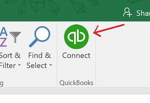
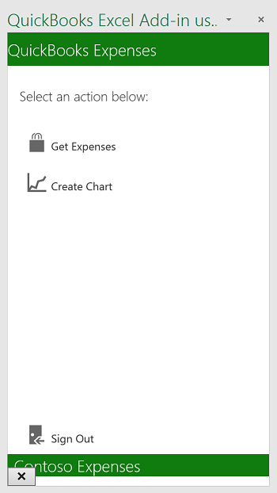

# <a name="excel-add-in-with-aspnet-and-quickbooks"></a>Надстройка Excel на базе ASP.NET для QuickBooks

Надстройка Excel может подключаться к таким службам, как QuickBooks, и импортировать данные на лист Excel. Надстройка Excel, предложенная на этой странице, подключается к QuickBooks, получает образец данных о расходах из тестовой учетной записи **Sandbox Company_US_1**, предоставленной QuickBooks, и импортирует эти данные на лист. Кроме того, в этой надстройке предусмотрена кнопка создания диаграммы из образца данных.

## <a name="table-of-contents"></a>Содержание

* [Необходимые компоненты](#prerequisites)
* [Настройка проекта](#configure-the-project)
* [Запуск проекта](#run-the-project)
* [Разбор кода](#understand-the-code)
* [Подключение к Office 365](#connect-to-office-365)
* [Вопросы и комментарии](#questions-and-comments)
* [Дополнительные ресурсы](#additional-resources)

## <a name="prerequisites"></a>Необходимые компоненты

* Учетная запись [разработчика решений для QuickBooks](https://developer.intuit.com/).
* [Visual Studio 2015](https://www.visualstudio.com/downloads/download-visual-studio-vs.aspx).
* [Инструменты разработчика Office для Visual Studio](https://www.visualstudio.com/en-us/features/office-tools-vs.aspx).

## <a name="configure-the-project"></a>Настройка проекта

Для начала настройте приложение на сайте developer.intuit.com.

1. Перейдите по адресу https://developer.intuit.com/ и зарегистрируйтесь для получения учетной записи разработчика, а затем выполните вход.
2. В правом верхнем углу щелкните команду **My Apps** (Мои приложения), а затем выберите приложение или нажмите кнопку **Create new app** (Создать приложение). 
3. Выбрав приложение, выберите элементы **Development** (Разработка) > **Keys** (Ключи) и скопируйте данные в полях **OAuth Consumer Key** (Ключ клиента OAuth) и **OAuth Consumer Secret** (Секрет клиента OAuth) для дальнейшего использования.
4. Скачайте или клонируйте пример на локальный компьютер.
5. Откройте файл решения **QbAdd-inDotNet.sln** в Visual Studio.
6. В Visual Studio откройте файл **Web.config** и вставьте значения `ConsumerKey` и `ConsumerSecret`, как показано ниже.

```
<appSettings>
    <!-- QuickBooks Settings -->
    <add key="ConsumerKey" value="insert your OAuth Consumer Key here" />
    <add key="ConsumerSecret" value="insert your OAuth Consumer Secret here" />
    <add key="OauthLink" value="https://oauth.intuit.com/oauth/v1" />
    <add key="AuthorizeUrl" value="https://workplace.intuit.com/Connect/Begin" />
    <add key="RequestTokenUrl" value="https://oauth.intuit.com/oauth/v1/get_request_token" />
    <add key="AccessTokenUrl" value="https://oauth.intuit.com/oauth/v1/get_access_token" />
    <add key="ServiceContext.BaseUrl.Qbo" value="https://sandbox-quickbooks.api.intuit.com/" />
    <add key="DeepLink" value="sandbox.qbo.intuit.com" />
  </appSettings>
```

## <a name="run-the-project"></a>Запуск проекта

1. Нажмите клавишу F5, чтобы запустить проект.

2. Запустите надстройку, нажав соответствующую кнопку на ленте в Excel.<br>  

3. Нажмите кнопку **Connect to QuickBooks** (Подключиться к QuickBooks), чтобы открыть окно входа QuickBooks.<br>

4. Если в Visual Studio появится окно ошибки, нажмите кнопку **Продолжить** и вернитесь к Excel. Эта ошибка не связана с образцом.<br>

5. Войдите в QuickBooks с помощью учетной записи разработчика решений для QuickBooks.<br>

6. Нажмите кнопку **Authorize** (Авторизация), чтобы позволить QuickBooks отправлять данные в надстройку.<br> <br> В области задач отобразятся два действия на выбор. <br>

8. Нажмите кнопку **Get Expenses** (Получить данные о расходах), чтобы импортировать данные о расходах из QuickBooks в электронную таблицу. <br>

9. Нажмите кнопку **Create Chart** (Создать диаграмму), чтобы вставить диаграмму. <br>

## <a name="understand-the-code"></a>Разбор кода

* Файл [Home.html](QbAdd-inDotNetWeb/Home.html) определяет страницу области задач при запуске и после входа пользователя.
* Файл [Home.js](QbAdd-inDotNetWeb/Home.js) обрабатывает действия пользователя для входа, выхода, получения данных о расходах и вставки диаграммы. В этом файле вызывается API `dialogDisplayAsync`, чтобы открыть диалоговое окно входа в QuickBooks.
* Файл [QbAdd-inDotNet.xml](QbAdd-inDotNet/QbAdd-inDotNetManifest/QbAdd-inDotNet.xml) — файл манифеста надстройки. 
* Файл [QuickBooksController.cs](QbAdd-inDotNetWeb/Controllers/QuickBooksController.cs) получает данные о расходах из QuickBooks.
* Файл [FunctionFile.js](QbAdd-inDotNetWeb/Functions/FunctionFile.js) добавляет диаграмму в Excel.
* Файл [OAuthManager.aspx.cs](QbAdd-inDotNetWeb/OAuthManager.aspx.cs) выполняет вход в QuickBooks из API диалоговых окон.

## <a name="questions-and-comments"></a>Вопросы и комментарии

Будем рады получить ваши отзывы об образце *надстройки Excel на базе ASP.NET для QuickBooks*. Своими мыслями можете поделиться на вкладке *Issues* (Проблемы) этого репозитория. Общие вопросы о разработке решений для Office 365 следует задавать на сайте [Stack Overflow](http://stackoverflow.com/questions/tagged/Office365+API). Помечайте свои вопросы тегами [Office365] и [API].

## <a name="additional-resources"></a>Дополнительные ресурсы

* [Документация по API-интерфейсам Office 365](http://msdn.microsoft.com/office/office365/howto/platform-development-overview)
* [Средства для интеграции API-интерфейсов Microsoft Office 365](https://visualstudiogallery.msdn.microsoft.com/a15b85e6-69a7-4fdf-adda-a38066bb5155)
* [Центр разработчика Office](http://dev.office.com/)
* [Проекты API Office 365 и примеры кода для начинающих](http://msdn.microsoft.com/en-us/office/office365/howto/starter-projects-and-code-samples)

## <a name="copyright"></a>Авторское право
(c) Корпорация Майкрософт (Microsoft Corporation), 2016. Все права защищены.


Этот проект соответствует [правилам поведения Майкрософт, касающимся обращения с открытым кодом](https://opensource.microsoft.com/codeofconduct/). Дополнительную информацию см. в разделе [часто задаваемых вопросов по правилам поведения](https://opensource.microsoft.com/codeofconduct/faq/). Если у вас возникли вопросы или замечания, напишите нам по адресу [opencode@microsoft.com](mailto:opencode@microsoft.com).
