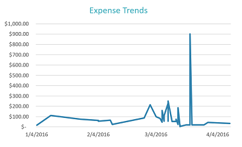

# 带有 ASP.NET 和 QuickBooks 的 Excel 外接程序

你的 Excel 外接程序可以连接到诸如 QuickBooks 的服务，并将数据导入到你的 Excel 电子表格。此 Excel 外接程序演示如何连接到 QuickBooks、从由 QuickBooks 提供的沙盒帐户“**沙盒 Company_US_1**”获取示例支出数据，以及将示例数据导入到电子表格。外接程序还提供了从示例数据创建图表的按钮。

## 目录

* [先决条件](#prerequisites)
* [配置项目](#configure-the-project)
* [运行项目](#run-the-project)
* [了解代码](#understand-the-code)
* [连接到 Office 365](#connect-to-office-365)
* [问题和意见](#questions-and-comments)
* [其他资源](#additional-resources)

## 先决条件

* [QuickBooks 开发人员](https://developer.intuit.com/)帐户
* [Visual Studio 2015](https://www.visualstudio.com/downloads/download-visual-studio-vs.aspx)
* [Visual Studio 的 Office 开发人员工具](https://www.visualstudio.com/en-us/features/office-tools-vs.aspx)

## 配置项目

在 developer.intuit.com 配置你的应用以便开始使用。

1. 转到 https://developer.intuit.com/ 并注册开发人员帐户，然后登录。
2. 在右上角，选择“**我的应用**”，然后选择一个应用或单击“**创建新应用**”。 
3. 应用被选中后，选择“**开发**|**密钥**”，然后将“**OAuth 使用者密钥**”和“**OAuth 用户机密**”复制到你稍后可以访问的位置。
4. 下载示例或将示例克隆到你的本地计算机。
5. 打开 Visual Studio 中的解决方案文件 **QbAdd-inDotNet.sln**。
6. 在 Visual Studio 中，打开“**Web.config**”并为 `ConsumerKey` 和 `ConsumerSecret` 插入值，如下所示。

```
<appSettings>
    <!-- QuickBooks Settings -->
    <add key="ConsumerKey" value="insert your OAuth Consumer Key here" />
    <add key="ConsumerSecret" value="insert your OAuth Consumer Secret here" />
    <add key="OauthLink" value="https://oauth.intuit.com/oauth/v1" />
    <add key="AuthorizeUrl" value="https://workplace.intuit.com/Connect/Begin" />
    <add key="RequestTokenUrl" value="https://oauth.intuit.com/oauth/v1/get_request_token" />
    <add key="AccessTokenUrl" value="https://oauth.intuit.com/oauth/v1/get_access_token" />
    <add key="ServiceContext.BaseUrl.Qbo" value="https://sandbox-quickbooks.api.intuit.com/" />
    <add key="DeepLink" value="sandbox.qbo.intuit.com" />
  </appSettings>
```

## 运行项目

1. 按“F5”键以运行项目。

2. 通过从 Excel 的功能区选择命令按钮来启动外接程序。<br></img>  

3. 单击“**连接到 QuickBooks**”以启动 QuickBooks 登录窗口。<br></img>

4. 如果在 Visual Studio 中打开了错误窗口，单击“**继续**”并返回到 Excel。此错误与示例不相关。<br></img>

5. 使用你的 QuickBooks 开发人员帐户登录到 QuickBooks。<br></img>

6. 单击“**授权**”以允许 QuickBooks 将数据发送到外接程序。<br></img> <br> 任务窗格将显示两个可供选择的操作。<br></img>

8. 选择“**获取支出**”以将支出从 QuickBooks 导入到电子表格。<br></img>

9. 选择“**创建图表**”以插入图表。<br></img>

## 了解代码

* [Home.html](QbAdd-inDotNetWeb/Home.html) - 定义启动时和用户登录后的任务窗格页面。
* [Home.js](QbAdd-inDotNetWeb/Home.js) - 处理登录、退出、获取支出和插入图表的用户交互。在这里，调用 `dialogDisplayAsync` API 以打开对话框窗口，供用户登录到 QuickBooks。
* [QbAdd-inDotNet.xml](QbAdd-inDotNet/QbAdd-inDotNetManifest/QbAdd-inDotNet.xml) - 外接程序的清单文件。 
* [QuickBooksController.cs](QbAdd-inDotNetWeb/Controllers/QuickBooksController.cs) - 从 QuickBooks 获取支出数据。
* [FunctionFile.js](QbAdd-inDotNetWeb/Functions/FunctionFile.js) - 向 Excel 添加图表。
* [OAuthManager.aspx.cs](QbAdd-inDotNetWeb/OAuthManager.aspx.cs) - 处理从对话框 API 登录到 QuickBooks。

## 问题和意见

我们乐于倾听你有关*带有 ASP.NET 和 QuickBooks 的 Excel 外接程序*示例的反馈。你可以在该存储库中的“*问题*”部分将反馈发送给我们。与 Office 365 开发相关的问题一般应发布到 [Stack Overflow](http://stackoverflow.com/questions/tagged/Office365+API)。确保你的问题使用了 [Office365] 和 [API] 标记。

## 其他资源

* [Office 365 API 文档](http://msdn.microsoft.com/office/office365/howto/platform-development-overview)
* [Microsoft Office 365 API 工具](https://visualstudiogallery.msdn.microsoft.com/a15b85e6-69a7-4fdf-adda-a38066bb5155)
* [Office 开发人员中心](http://dev.office.com/)
* [Office 365 API 初学者项目和代码示例](http://msdn.microsoft.com/en-us/office/office365/howto/starter-projects-and-code-samples)

## 版权
版权所有 (c) 2016 Microsoft。保留所有权利。

