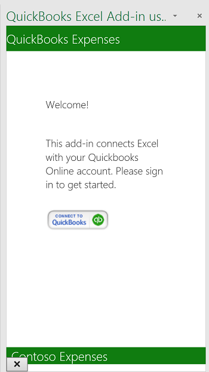

# Excel Add-in with ASP.NET and QuickBooks

Your Excel Add-in can connect to a service like QuickBooks and import data into your Excel spreadsheet. 
This Excel Add-in demonstrates how to connect to QuickBooks, gets sample expense data from a sandbox account provided by QuickBooks, **Sandbox Company_US_1**, and imports the sample data into a spreadsheet. The add-in also provides a button to create a chart from the sample data.

## Table of Contents

* [Prerequisites](#prerequisites)
* [Configure the project](#configure-the-project)
* [Run the project](#run-the-project)
* [Understand the code](#understand-the-code)
* [Connect to Office 365](#connect-to-office-365)
* [Questions and comments](#questions-and-comments)
* [Additional resources](#additional-resources)

## Prerequisites

* A [QuickBooks developer](https://developer.intuit.com/) account
* [Visual Studio 2015](https://www.visualstudio.com/downloads/download-visual-studio-vs.aspx)
* [Office Developer Tools for Visual Studio](https://www.visualstudio.com/en-us/features/office-tools-vs.aspx)

## Configure the project

Configure your app at developer.intuit.com to get started.

1. Go to https://developer.intuit.com/ and sign up for a developer account, and then sign in.
2. In the upper right hand corner, choose **My Apps** and select an app or click **Create new app**. 
3. Once the app is selected, choose **Development** | **Keys**, and copy **OAuth Consumer Key** and **OAuth Consumer Secret** to a place where you can access them later.
4. Download or clone the sample to your local machine.
5. Open the solution file **QbAdd-inDotNet.sln** in Visual Studio.
6. In Visual Studio, open **Web.config** and insert the values for `ConsumerKey` and `ConsumerSecret`, like this.

```
<appSettings>
    <!-- QuickBooks Settings -->
    <add key="ConsumerKey" value="insert your OAuth Consumer Key here" />
    <add key="ConsumerSecret" value="insert your OAuth Consumer Secret here" />
    <add key="OauthLink" value="https://oauth.intuit.com/oauth/v1" />
    <add key="AuthorizeUrl" value="https://workplace.intuit.com/Connect/Begin" />
    <add key="RequestTokenUrl" value="https://oauth.intuit.com/oauth/v1/get_request_token" />
    <add key="AccessTokenUrl" value="https://oauth.intuit.com/oauth/v1/get_access_token" />
    <add key="ServiceContext.BaseUrl.Qbo" value="https://sandbox-quickbooks.api.intuit.com/" />
    <add key="DeepLink" value="sandbox.qbo.intuit.com" />
  </appSettings>
```

## Run the project

1. Press F5 to run the project.

2. Launch the add-in by selecting the command button from the ribbon in Excel.<br>  

3. Click **Connect to QuickBooks** to launch the QuickBooks sign-in window.<br>

4. If an error window opens in Visual Studio, click **Continue** and navigate back to Excel. This error is unrelated to the sample.<br>

5. Sign in to QuickBooks with your QuickBooks developer account.<br>

6. Click **Authorize** to allow QuickBooks to send data to the add-in.<br> <br> The task pane will display two actions to choose from. <br>

8. Choose **Get Expenses** to import expenses from QuickBooks into a spreadsheet. <br>

9. Choose **Create Chart** to insert a chart. <br>

## Understand the code

* [Home.html](QbAdd-inDotNetWeb/home.html) - Defines the task pane page on start up, and after the user has logged in.
* [Home.js](QbAdd-inDotNetWeb/home.js) - Handles user interaction for sign in, sign out, get expenses, and insert chart. Here, the `dialogDisplayAsync` API is called to open a dialog window for the user to sign in to QuickBooks.
* [QbAdd-inDotNet.xml](QbAdd-inDotNet/QbAdd-inDotNetManifest/QbAdd-inDotNet.xml) - The manifest file for the add-in. 
* [QuickBooksController.cs](QbAdd-inDotNetWeb/Controllers/QuickBooksController.cs) - Gets expense data from QuickBooks.
* [FunctionFile.js](QbAdd-inDotNetWeb/Functions/FunctionFile.js) - Adds a chart to Excel.
* [OAuthManager.aspx.cs](QbAdd-inDotNetWeb/OAuthManager.aspx.cs) - Handles sign in to QuickBooks from the dialog API.

## Questions and comments

We'd love to get your feedback on the *Excel Add-in with ASPNET and QuickBooks* sample. You can send your feedback to us in the *Issues* section of this repository. 
Questions about Office 365 development in general should be posted to [Stack Overflow](http://stackoverflow.com/questions/tagged/Office365+API). Make sure that your questions are tagged with [Office365] and [API].

## Additional resources

* [Office 365 APIs documentation](http://msdn.microsoft.com/office/office365/howto/platform-development-overview)
* [Microsoft Office 365 API Tools](https://visualstudiogallery.msdn.microsoft.com/a15b85e6-69a7-4fdf-adda-a38066bb5155)
* [Office Dev Center](http://dev.office.com/)
* [Office 365 APIs starter projects and code samples](http://msdn.microsoft.com/en-us/office/office365/howto/starter-projects-and-code-samples)

## Copyright
Copyright (c) 2016 Microsoft. All rights reserved.
